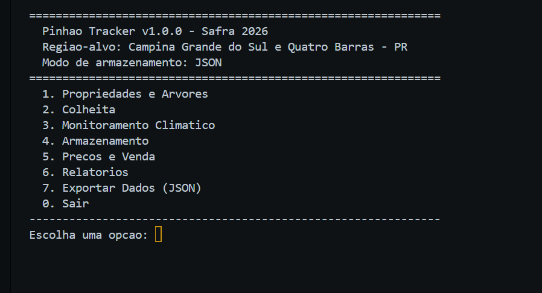
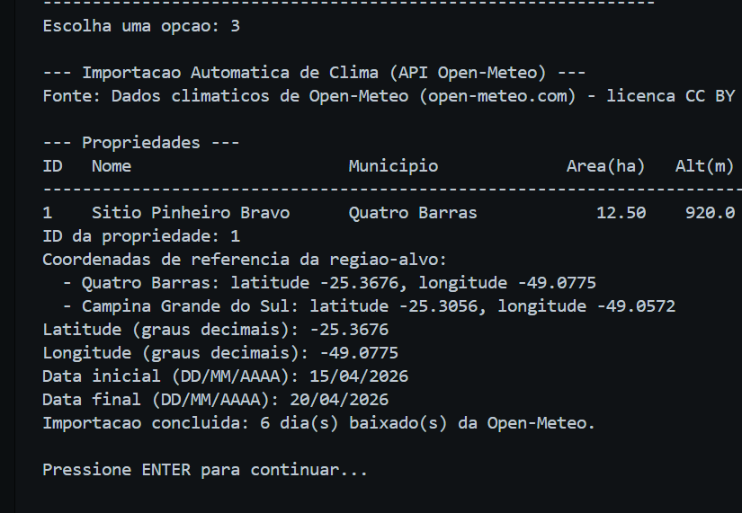
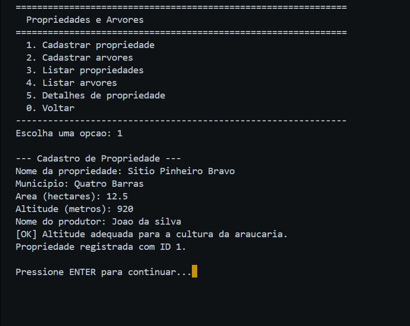
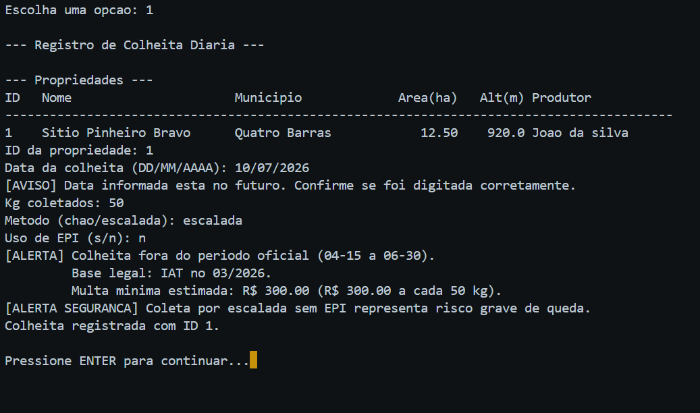
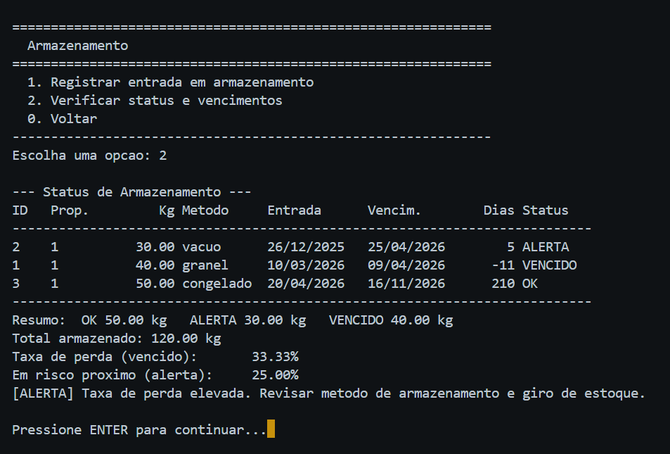
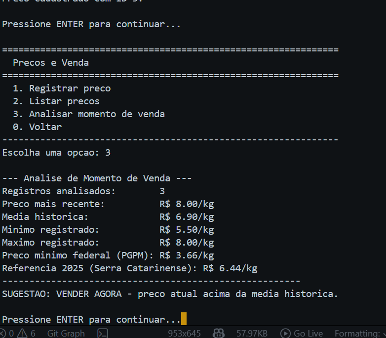

 <br>
 
 # Pinhão Tracker

Sistema de gestão da produção de pinhão (semente da *Araucaria angustifolia*) para pequenos produtores de **Campina Grande do Sul** e **Quatro Barras**, no Paraná. Projeto acadêmico FIAP 2026.

## Por que esse projeto existe

Se você nunca foi ao sul do Brasil, é provável que nunca tenha ouvido falar em pinhão. É a **semente da araucária**, árvore-símbolo do Paraná, de **gosto único**, colhida entre 15/04 e 30/06 por força da **IN IAT nº 03/2026**. Cozida, assada ou torrada, é base de receitas tradicionais do sul.

Nasci em **Quatro Barras**, no Primeiro Planalto Paranaense. O produtor familiar do pinhão lida com regulações específicas e uma janela curta de renda, e precisa de ferramentas que o ajudem a registrar, analisar e gerenciar a safra. O recorte geográfico do projeto (Quatro Barras + Campina Grande do Sul) tem três justificativas objetivas:

- **Eixo da Rota do Pinhão** — circuito turístico oficial do PR que concentra os maiores remanescentes de araucária; é onde a cadeia extrativista é mais densa.
- **Altitude e clima ideais** — acima de 800 m na Serra do Mar, dentro da faixa ótima para a espécie (15 a 25 °C).
- **Cooperativismo ativo** — a **Cooperativa Nascente** agrega extrativistas da microrregião, multiplicando o impacto de uma ferramenta comum.

## O pinhão em números

- **Paraná lidera em valor**: 43,3% do valor nacional de produção (R$ 26,8 mi de R$ 61,9 mi) em 2023, segundo **PEVS/IBGE**. Disputa o 1º lugar em volume com MG ano a ano (38,5% em 2021, 32,9% em 2023).
- **100% extrativismo**: o IBGE classifica toda a produção como **extração vegetal** — sai de árvores nativas em pé, nas mãos de famílias vizinhas a remanescentes de floresta.
- **1/3 da renda anual em 75 dias**: reportagem da Sedest-PR documenta Elizabeth Guedes de Freitas Costa, produtora de **Campina Grande do Sul**, para quem o pinhão é um terço da renda anual, concentrado na janela legal.
- **Pequeno no agregado, concentrado na região**: 3,3% do valor nacional dos não-madeireiros, mas concentrado em poucas microrregiões — das quais a Rota do Pinhão é a principal.

## O problema

Pequenos produtores operam em caderno ou na memória, o que gera quatro dores recorrentes:

1. **Desconhecimento de produtividade por safra** — sem histórico de kg/dia, não há base para negociar com cooperativa nem pleitear crédito rural.
2. **Ausência de histórico climático** — sem dado atrelado, não dá para saber se a safra fraca foi culpa da geada tardia ou do outono seco.
3. **Venda no momento errado** — sem referência de preço, vende-se ao primeiro atravessador; esperar 2–3 semanas significaria 30–40% a mais no quilo.
4. **Perdas pós-colheita** — a granel, 30 dias; vácuo refrigerado, 120; congelado, até 210. Sem controle, o produto vence no armazém.

## Solução proposta

Sistema de terminal em Python 3.12+ que oferece:

- **Cadastro de propriedade e árvores** (nativa/enxertada, idade) com alertas de altitude e faixa produtiva.
- **Registro de colheita diária** com validação do período oficial (IAT nº 03/2026) e multa estimada para coleta fora da janela.
- **Monitoramento climático** manual ou em lote via `.txt`, com avaliação contra faixas ideais.
- **Controle de armazenamento** com cálculo automático de vencimento por método e **totalização de perdas** em kg e %.
- **Análise de momento de venda** comparando preço atual com média histórica e PGPM-Bio, sugerindo **vender agora** ou **aguardar**.
- **Relatórios** de produtividade por safra e por propriedade, comparativo entre anos, custo vs receita.
- **Log de operações** em `.txt` e **exportação** em `.json`.

### Dados científicos embutidos

| Parâmetro | Valor |
| --- | --- |
| Período de safra no PR | 15/04 a 30/06 (IAT nº 03/2026) |
| Pinhões por pinha | 100 a 120 |
| Idade produtiva — nativa / enxertada | 12–15 / 6–8 anos |
| Temperatura ideal / altitude mínima | 15–25 °C / 800 m |
| Armazenamento: granel / vácuo / congelado | 30 / 120 / 210 dias |
| PGPM-Bio (mínimo federal) | R$ 3,66/kg |
| Preço médio produtor 2025 (Serra Catarinense) | R$ 6,44/kg |
| Multa por coleta fora da safra | R$ 300 a cada 50 kg apreendidos |

## Requisitos técnicos atendidos

- **Subalgoritmos** com passagem de parâmetros em todas as funcionalidades.
- **Estruturas de dados**: listas (coleções de registros), tuplas (opções de menu, faixas, coordenadas), dicionários (config, registros, agregações).
- **Tabela em memória**: importações em lote de clima constroem uma `list[dict]` simulando a tabela do banco, manipulada (adição de `propriedade_id`) e resumida em preview (`exibir_resumo_tabela_memoria` em `modules/clima.py`) para revisão **antes de persistir** — o usuário confirma ou aborta a gravação com base nos agregados (total, período, faixas de temperatura/umidade/precipitação).
- **Manipulação de arquivos**: `.txt` (log + importação de clima) e `.json` (config + exportação).
- **Banco Oracle** via `oracledb`, com **fallback gracioso para JSON** se o Oracle estiver indisponível.

## Instalação e execução

```bash
python -m venv .venv
source .venv/bin/activate      # Linux/macOS — Windows: .venv\Scripts\activate
pip install oracledb           # opcional; sem ele o sistema opera em modo JSON
python main.py
```

Requer **Python 3.12+**. Única dependência externa: `oracledb` (opcional).

### Oracle (opcional)

Ajustar credenciais em `config.json` → `"oracle"` e criar tabelas:

```bash
sqlplus seu_usuario/sua_senha@seu_dsn @setup_database.sql
```

Sem Oracle, o armazenamento é em `dados/dados.json`.

### Menu principal



### Importação de clima via `.txt`

Formato em `dados/clima_exemplo.txt`:

```csv
DD/MM/AAAA;temperatura;umidade;precipitacao
15/04/2026;14.2;85.0;8.5
```

Linhas iniciadas por `#` são comentários.

## Recurso extra: API Open-Meteo

Além da importação por `.txt` (que atende integralmente o requisito), o sistema oferece importação automática via **API pública da Open-Meteo** — serviço gratuito, sem chave de acesso. Fluxo: `3. Monitoramento Climatico → 3. Importar clima da API Open-Meteo (extra)` → ID da propriedade → latitude e longitude (sugestões de Quatro Barras e CGS são exibidas) → intervalo de datas. O sistema baixa temperatura média, umidade e precipitação diárias e grava em `registros_climaticos`.



Detalhes: usa apenas `urllib.request` + `json` da **stdlib** (zero libs externas adicionais). Em falha de rede, API fora do ar ou timeout, o sistema avisa e sugere o fallback por `.txt` — nada é gravado parcialmente. Desativar: `config.json → api_clima.habilitada = false`. Dados sob licença **CC BY 4.0 da Open-Meteo**, atribuição exibida em cada uso.

```json
"api_clima": {
  "habilitada": true,
  "url_base": "https://archive-api.open-meteo.com/v1/archive",
  "timeout_segundos": 15,
  "atribuicao": "Dados climaticos de Open-Meteo (open-meteo.com) - licenca CC BY 4.0"
}
```

## Capturas de tela

### Cadastro de propriedade com validação semântica



Valida cada entrada e compara altitude com o mínimo ideal (800 m) — `[OK]` se adequado, `[ALERTA]` caso contrário. Validação que olha o **sentido agronômico** do dado, não só o tipo.

### Colheita fora do período legal (3 validações em 1 tela)



Para uma colheita em 10/07/2026, escalada, sem EPI, o sistema dispara três validações independentes: `[ALERTA]` de fora do período oficial com base legal; cálculo automático de **multa** (R$ 300 por faixa de 50 kg); `[ALERTA SEGURANCA]` para escalada sem EPI.

### Painel de armazenamento com taxa de perda



Lotes com validade por método (30/120/210 dias). Rodapé totaliza OK/ALERTA/VENCIDO, calcula **taxa de perda em %** e alerta quando passa de 5%. Transforma registro em métrica de gestão — ataca a 4ª dor.

### Análise de momento de venda



Seis indicadores (atual, média, mín/máx, PGPM-Bio, referência 2025) e **recomendação objetiva**: `VENDER AGORA`, `AGUARDAR` ou `NEUTRO` com justificativa. Ataca a 3ª dor.

### Preview da tabela em memória


Demonstração direta do requisito de **tabela em memória**: a `list[dict]` é construída, manipulada (`propriedade_id`) e resumida antes da persistência. O produtor confirma ou aborta com base nos agregados.

## Estrutura

```text
pinhao-tracker/
├── main.py                      # Ponto de entrada
├── config.json                  # Configurações e dados científicos
├── setup_database.sql           # DDL das tabelas Oracle
├── README.md
├── dados/
│   ├── clima_exemplo.txt        # Formato para importação por .txt
│   └── dados.json / exportacao.json / log_operacoes.txt   # Gerados em runtime
└── modules/
    ├── api_clima.py             # Cliente HTTP Open-Meteo (extra)
    ├── arquivo.py               # I/O de .txt e .json
    ├── armazenamento.py         # Controle pós-colheita
    ├── clima.py                 # Monitoramento climático
    ├── colheita.py              # Registro de colheita
    ├── database.py              # Oracle + fallback JSON
    ├── menu.py                  # Menus e navegação
    ├── precos.py                # Preços e recomendação de venda
    ├── propriedade.py           # Propriedades e árvores
    ├── relatorios.py            # Relatórios consolidados
    └── validacao.py             # Validação de entradas
```

## Repositório

GitHub: [leticiael/pinhao-tracker](https://github.com/leticiael/pinhao-tracker)

## Fontes

- **PEVS/IBGE 2021 e 2023** — produção e valor do pinhão: <https://www.ibge.gov.br/estatisticas/economicas/agricultura-e-pecuaria/9105-producao-da-extracao-vegetal-e-da-silvicultura.html>
- **Caso Elizabeth Guedes / CGS** — Sedest-PR: <https://www.sedest.pr.gov.br/Noticia/No-Parana-pinhao-gera-renda-para-pequenos-produtores>
- **Conservação da araucária** — IUCN Red List; Fundação Grupo Boticário: <https://fundacaogrupoboticario.org.br/ameacada-floresta-com-araucarias-ainda-e-motivo-de-preocupacao/>
- **Remanescentes no PR** — Mongabay Brasil: <https://brasil.mongabay.com/2022/03/araucarias-em-rota-de-extincao-sao-cortadas-com-aval-dos-orgaos-publicos/>
- **IN IAT nº 03/2026** — período oficial de coleta no PR.
- **PGPM-Bio** — Conab / Ministério da Agricultura; preço mínimo R$ 3,66/kg.
